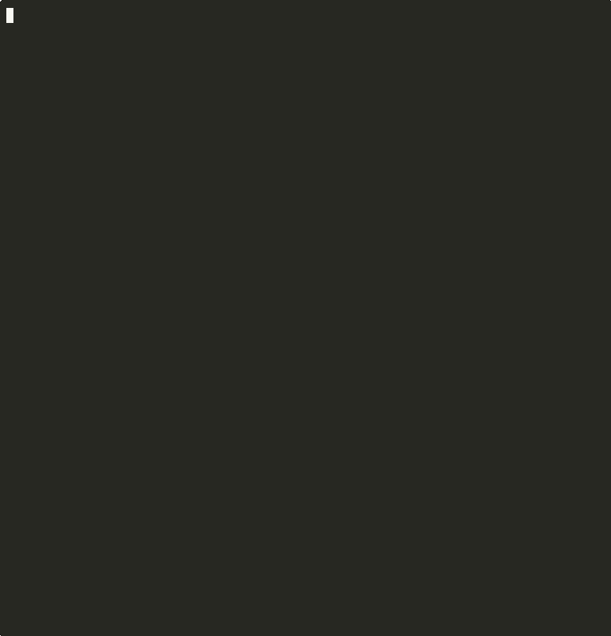

# Multi-Agent 智能写作系统 / Multi-Agent AI Writing System

[中文](#中文) | [English](#english)

---



---

## 中文

一个基于多智能体协作的 AI 内容生成系统，自动完成「热点抓取 → 文章撰写 → 审校修改」全流程，输出适合微信公众号发布的高质量科技文章。

### 系统架构

```
ResearcherAgent          WriterAgent              ReviewerAgent
     │                        │                        │
DuckDuckGo 实时搜索    公众号风格写作 Prompt       公众号主编评审标准
     │                        │                        │
     └──────────── Orchestrator 编排层 ────────────────┘
                              │
                    main.py CLI 入口
```

**五层分离架构：**

| 层级 | 文件 | 职责 |
|------|------|------|
| 配置层 | `config.py` | 所有参数的唯一来源（7 个 Config 类） |
| 框架层 | `base_agent.py` | 消息协议、LLMClient、BaseAgent 抽象类 |
| 业务层 | `agents.py` | Researcher / Writer / Reviewer 三个智能体 |
| 编排层 | `orchestrator.py` | 工作流调度、审校循环 |
| 应用层 | `main.py` | CLI 入口、结果输出 |

### 核心功能

- **实时热点抓取**：通过 DuckDuckGo 搜索最近 7 天真实新闻，LLM 筛选并推荐最佳选题
- **公众号风格写作**：短段落、口语化、移动端适配，自动生成 A/B/C 三个备选标题
- **多轮审校循环**：ReviewerAgent 按公众号维度评分，WriterAgent 自主评估反馈价值后修改
- **双格式输出**：`output.json`（完整数据）+ `output.md`（可直接粘贴的 Markdown 文章）
- **实验追踪**：每次运行自动记录到 `experiments.tsv`，统计通过率和平均分

### 快速开始

**1. 克隆并安装依赖**

```bash
git clone <repo-url>
cd multi-agent

pip install -r requirements.txt
```

> 如需运行测试，改用 `pip install -r requirements-dev.txt`

**2. 配置 API Key**

```bash
cp .env.example .env
```

编辑 `.env`，填入你的 LLM API Key，并取消注释对应服务商的配置块：

```bash
# 必填
LLM_API_KEY=your-api-key-here

# 示例：使用 DeepSeek
LLM_BASE_URL=https://api.deepseek.com/v1
LLM_MODEL=deepseek-chat
LLM_API_STYLE=openai
```

> 支持 Kimi、DeepSeek、OpenAI、Claude、Qwen、智谱 GLM、Ollama 等，
> 完整配置示例见 [.env.example](.env.example) 和[支持的 LLM API](#支持的-llm-api) 章节。

**3. 验证配置（可选）**

```bash
# 使用 Mock LLM 快速验证系统运行正常，无需真实 API Key
python main.py --demo
```

**4. 运行**

```bash
# 默认配置（AI 领域，深度分析，1000 字）
python main.py

# 自定义参数
python main.py --topic 量子计算 --style 科普入门 --words 800
python main.py --topic 机器人 --pass-threshold 80
python main.py --topic 大模型 --max-revisions 3 --output result.json
```

**5. 查看结果**

```
output.md    # Markdown 文章（可直接复制到公众号编辑器）
output.json  # 完整数据（含热点列表、审校历史、评分等）
```

### CLI 参数说明

| 参数 | 默认值 | 说明 |
|------|--------|------|
| `--topic` | `AI` | 搜索领域 |
| `--style` | `深度分析` | 文章风格 |
| `--words` | `1000` | 目标字数 |
| `--count` | `5` | 热点抓取数量 |
| `--max-revisions` | `2` | 最大审校修改轮次 |
| `--pass-threshold` | `85` | 审校通过最低分（1-100） |
| `--output` | `output.json` | JSON 输出文件路径 |
| `--description` | - | 本次实验描述（记录到 experiments.tsv） |

### 配置说明

所有参数集中在 `config.py`，修改后无需传 CLI 参数：

```python
# 修改默认领域和字数
class CliDefaults:
    topic:      str = "AI"
    word_count: int = 1000

# 调整审校评分维度权重
class ReviewConfig:
    dimension_weights = {
        "content_insight": 30,  # 内容洞察
        "readability":     25,  # 可读性
        "title_appeal":    20,  # 标题吸引力
        "structure_flow":  15,  # 结构流畅
        "accuracy":        10,  # 事实准确性
    }

# 支持通过环境变量覆盖的客户端参数
# LLM_TIMEOUT, LLM_MAX_TOKENS, LLM_MAX_RETRIES
# LLM_BASE_URL, LLM_MODEL, LLM_API_STYLE
```

### 支持的 LLM API

在 `.env` 中取消注释对应配置块即可切换，所有 OpenAI 兼容服务商均支持：

```bash
# Kimi Code（默认，Anthropic 格式）
LLM_BASE_URL=https://api.kimi.com/coding/v1
LLM_MODEL=kimi-for-coding
LLM_API_STYLE=anthropic

# Kimi（moonshot，OpenAI 兼容）
LLM_BASE_URL=https://api.moonshot.cn/v1
LLM_MODEL=moonshot-v1-8k
LLM_API_STYLE=openai

# DeepSeek
LLM_BASE_URL=https://api.deepseek.com/v1
LLM_MODEL=deepseek-chat
LLM_API_STYLE=openai

# OpenAI
LLM_BASE_URL=https://api.openai.com/v1
LLM_MODEL=gpt-4o
LLM_API_STYLE=openai

# Anthropic Claude
LLM_BASE_URL=https://api.anthropic.com/v1
LLM_MODEL=claude-3-5-sonnet-20241022
LLM_API_STYLE=anthropic

# Qwen（通义千问）
LLM_BASE_URL=https://dashscope.aliyuncs.com/compatible-mode/v1
LLM_MODEL=qwen-plus
LLM_API_STYLE=openai

# 智谱 GLM
LLM_BASE_URL=https://open.bigmodel.cn/api/paas/v4
LLM_MODEL=glm-4-flash
LLM_API_STYLE=openai

# Ollama（本地部署）
LLM_BASE_URL=http://localhost:11434/v1
LLM_MODEL=llama3.2
LLM_API_STYLE=openai
LLM_API_KEY=ollama   # 不需要真实 Key，填任意字符串
```

> 完整配置示例见 [.env.example](.env.example)

### 运行测试

```bash
# 运行全部测试（不需要真实 API Key）
python -m pytest -v

# 带覆盖率报告
python -m pytest --cov
```

当前测试状态：**136/136 通过，覆盖率 94%**

### 项目结构

```
multi-agent/
├── main.py              # CLI 入口
├── base_agent.py        # 框架层：消息协议 + LLMClient + BaseAgent
├── config.py            # 配置层：7 个 Config 类（带参数校验）
├── agents.py            # 业务层：3 个智能体 + TypedDict 类型定义
├── orchestrator.py      # 编排层：工作流调度
├── search.py            # 搜索层：DuckDuckGo 封装（含客户端时间过滤）
├── experiments.py       # 追踪层：实验日志 TSV 读写
├── .env.example         # API Key 配置模板
├── requirements.txt     # 生产依赖
├── requirements-dev.txt # 开发/测试依赖
└── tests/
    ├── conftest.py
    ├── mock_llm.py          # 测试专用 MockLLMClient
    ├── test_base_agent.py
    ├── test_config.py       # 含参数校验测试
    ├── test_agents.py
    ├── test_orchestrator.py
    └── test_experiments.py
```

### 工作流示意

```
1. 热点抓取
   DuckDuckGo 搜索（近 7 天）→ LLM 筛选 5 条热点 → 推荐最佳选题

2. 文章撰写
   选题 → LLM 按公众号风格写作 → 生成正文 + 三个备选标题

3. 审校循环（最多 max_revisions 轮）
   ReviewerAgent 评分 → 通过（≥85）则输出
                       → 未通过则 WriterAgent 评估反馈 → 修改 → 再审校

4. 输出
   output.md（文章）+ output.json（完整数据）
```

### 设计亮点

- **单一真相来源**：所有参数集中在 `config.py`，无散落硬编码
- **严格 API Key 管理**：Key 必须通过 `.env` 提供，缺失时启动即报错
- **LLM 自修复 JSON**：4 级递进解析策略，LLM 输出格式错误时自动重试修复
- **WriterAgent 自主决策**：评估审校反馈价值，拒绝无意义反馈，避免无效修改
- **客户端时间过滤**：DuckDuckGo `timelimit` 参数不可靠，客户端二次过滤确保新闻在时间窗口内
- **依赖注入**：各 Agent 通过构造函数接收 Config，测试时可注入自定义配置

---

## English

A multi-agent AI content generation system that automates the full pipeline of **trending topic discovery → article writing → editorial review**, producing high-quality tech articles ready for WeChat Official Accounts.

### Architecture

```
ResearcherAgent          WriterAgent              ReviewerAgent
     │                        │                        │
DuckDuckGo Live Search   WeChat-style Prompt      Editorial Review Criteria
     │                        │                        │
     └──────────── Orchestrator (Workflow Layer) ──────┘
                              │
                    main.py CLI Entry Point
```

**5-Layer Separation:**

| Layer | File | Responsibility |
|-------|------|----------------|
| Config | `config.py` | Single source of truth for all parameters (7 Config classes) |
| Framework | `base_agent.py` | Message protocol, LLMClient, BaseAgent abstract class |
| Business | `agents.py` | Researcher / Writer / Reviewer agents |
| Orchestration | `orchestrator.py` | Workflow scheduling, review loop |
| Application | `main.py` | CLI entry point, result output |

### Features

- **Real-time trending topics**: Searches DuckDuckGo for the last 7 days of news; LLM filters and recommends the best topic
- **WeChat-style writing**: Short paragraphs, conversational tone, mobile-optimized; auto-generates 3 alternative titles (A/B/C)
- **Multi-round review loop**: ReviewerAgent scores by WeChat dimensions; WriterAgent autonomously evaluates feedback value before revising
- **Dual-format output**: `output.json` (full data) + `output.md` (paste-ready Markdown article)
- **Experiment tracking**: Each run is automatically logged to `experiments.tsv` with pass rate and average score

### Quick Start

**1. Clone and install dependencies**

```bash
git clone <repo-url>
cd multi-agent

pip install -r requirements.txt
```

> For running tests, use `pip install -r requirements-dev.txt` instead.

**2. Configure API Key**

```bash
cp .env.example .env
```

Edit `.env`, fill in your API Key and uncomment the block for your provider:

```bash
# Required
LLM_API_KEY=your-api-key-here

# Example: DeepSeek
LLM_BASE_URL=https://api.deepseek.com/v1
LLM_MODEL=deepseek-chat
LLM_API_STYLE=openai
```

> Supports Kimi, DeepSeek, OpenAI, Claude, Qwen, Zhipu GLM, Ollama, and more.
> See [.env.example](.env.example) and [Supported LLM APIs](#supported-llm-apis) for all options.

**3. Verify setup (optional)**

```bash
# Run with Mock LLM to verify the system works without a real API Key
python main.py --demo
```

**4. Run**

```bash
# Default config (AI domain, deep analysis, 1000 words)
python main.py

# Custom parameters
python main.py --topic "quantum computing" --style "popular science" --words 800
python main.py --topic "robotics" --pass-threshold 80
python main.py --topic "LLM" --max-revisions 3 --output result.json
```

**5. View results**

```
output.md    # Markdown article (paste directly into WeChat editor)
output.json  # Full data (trending list, review history, scores, etc.)
```

### CLI Reference

| Argument | Default | Description |
|----------|---------|-------------|
| `--topic` | `AI` | Search domain |
| `--style` | `深度分析` | Article style |
| `--words` | `1000` | Target word count |
| `--count` | `5` | Number of trending topics to fetch |
| `--max-revisions` | `2` | Maximum review-revision rounds |
| `--pass-threshold` | `85` | Minimum passing score (1-100) |
| `--output` | `output.json` | JSON output file path |
| `--description` | - | Experiment description (logged to experiments.tsv) |

### Configuration

All parameters are centralized in `config.py`:

```python
# Change default domain and word count
class CliDefaults:
    topic:      str = "AI"
    word_count: int = 1000

# Adjust review scoring dimension weights
class ReviewConfig:
    dimension_weights = {
        "content_insight": 30,  # Content insight
        "readability":     25,  # Readability
        "title_appeal":    20,  # Title appeal
        "structure_flow":  15,  # Structure flow
        "accuracy":        10,  # Factual accuracy
    }

# Environment variable overrides
# LLM_TIMEOUT, LLM_MAX_TOKENS, LLM_MAX_RETRIES
# LLM_BASE_URL, LLM_MODEL, LLM_API_STYLE
```

### Supported LLM APIs

Uncomment the corresponding block in `.env` to switch providers. All OpenAI-compatible services are supported:

```bash
# Kimi Code (default, Anthropic format)
LLM_BASE_URL=https://api.kimi.com/coding/v1
LLM_MODEL=kimi-for-coding
LLM_API_STYLE=anthropic

# Kimi (moonshot, OpenAI-compatible)
LLM_BASE_URL=https://api.moonshot.cn/v1
LLM_MODEL=moonshot-v1-8k
LLM_API_STYLE=openai

# DeepSeek
LLM_BASE_URL=https://api.deepseek.com/v1
LLM_MODEL=deepseek-chat
LLM_API_STYLE=openai

# OpenAI
LLM_BASE_URL=https://api.openai.com/v1
LLM_MODEL=gpt-4o
LLM_API_STYLE=openai

# Anthropic Claude
LLM_BASE_URL=https://api.anthropic.com/v1
LLM_MODEL=claude-3-5-sonnet-20241022
LLM_API_STYLE=anthropic

# Qwen
LLM_BASE_URL=https://dashscope.aliyuncs.com/compatible-mode/v1
LLM_MODEL=qwen-plus
LLM_API_STYLE=openai

# Zhipu GLM
LLM_BASE_URL=https://open.bigmodel.cn/api/paas/v4
LLM_MODEL=glm-4-flash
LLM_API_STYLE=openai

# Ollama (local)
LLM_BASE_URL=http://localhost:11434/v1
LLM_MODEL=llama3.2
LLM_API_STYLE=openai
LLM_API_KEY=ollama   # No real key needed, any string works
```

> See [.env.example](.env.example) for the full configuration template.

### Running Tests

```bash
# Run all tests (no real API Key needed)
python -m pytest -v

# With coverage report
python -m pytest --cov
```

Current test status: **136/136 passing, 94% coverage**

### Project Structure

```
multi-agent/
├── main.py              # CLI entry point
├── base_agent.py        # Framework: message protocol + LLMClient + BaseAgent
├── config.py            # Config: 7 Config classes with validation
├── agents.py            # Business: 3 agents + TypedDict definitions
├── orchestrator.py      # Orchestration: workflow scheduling
├── search.py            # Search: DuckDuckGo wrapper (with client-side time filter)
├── experiments.py       # Tracking: experiment log TSV read/write
├── .env.example         # API Key config template
├── requirements.txt     # Production dependencies
├── requirements-dev.txt # Dev/test dependencies
└── tests/
    ├── conftest.py
    ├── mock_llm.py          # MockLLMClient for testing
    ├── test_base_agent.py
    ├── test_config.py       # Includes parameter validation tests
    ├── test_agents.py
    ├── test_orchestrator.py
    └── test_experiments.py
```

### Workflow

```
1. Trending Topic Discovery
   DuckDuckGo search (last 7 days) → LLM filters 5 topics → recommends best topic

2. Article Writing
   Topic → LLM writes in WeChat style → body + 3 alternative titles

3. Review Loop (up to max_revisions rounds)
   ReviewerAgent scores → pass (≥85) → output
                        → fail → WriterAgent evaluates feedback → revise → re-review

4. Output
   output.md (article) + output.json (full data)
```

### Design Highlights

- **Single source of truth**: All parameters in `config.py`, no scattered hardcoding
- **Strict API Key management**: Key must be provided via `.env`; missing key causes immediate startup error
- **Self-healing JSON parsing**: 4-level progressive parsing strategy with automatic retry on LLM format errors
- **WriterAgent autonomy**: Evaluates feedback value and rejects low-value suggestions to avoid pointless revisions
- **Client-side time filtering**: DuckDuckGo `timelimit` is unreliable; client-side secondary filter ensures news is within the time window
- **Dependency injection**: Each agent receives Config via constructor, enabling custom config injection in tests

## License

MIT
